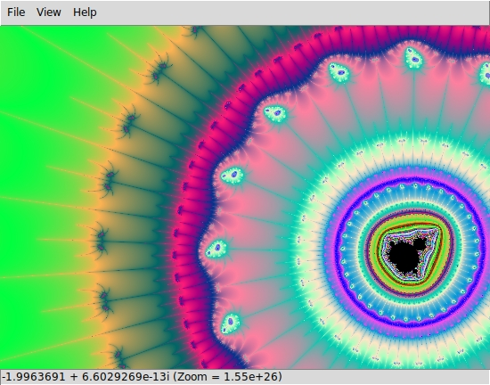

Mandelbrot
==========

This is a simple desktop tool for exploring the Mandelbrot set.

Features
--------

  * Parallel rendering
  * Arbitrary precision option
  * Multi-pass (progressive) rendering
  * Smooth coloring

Screenshots
-----------

Usage
-----

  * Scroll to zoom, drag to pan.
  * The maximum number of iterations can be configured from the `View` menu.
  * If you see glitches when you zoom beyond around (1e12)x, check `High precision` in the `View` menu.

Requirements
------------

  * Python 3
  * Pygame
  * Mpmath

No installation required: simply run `mandelbrot/main.py`.
